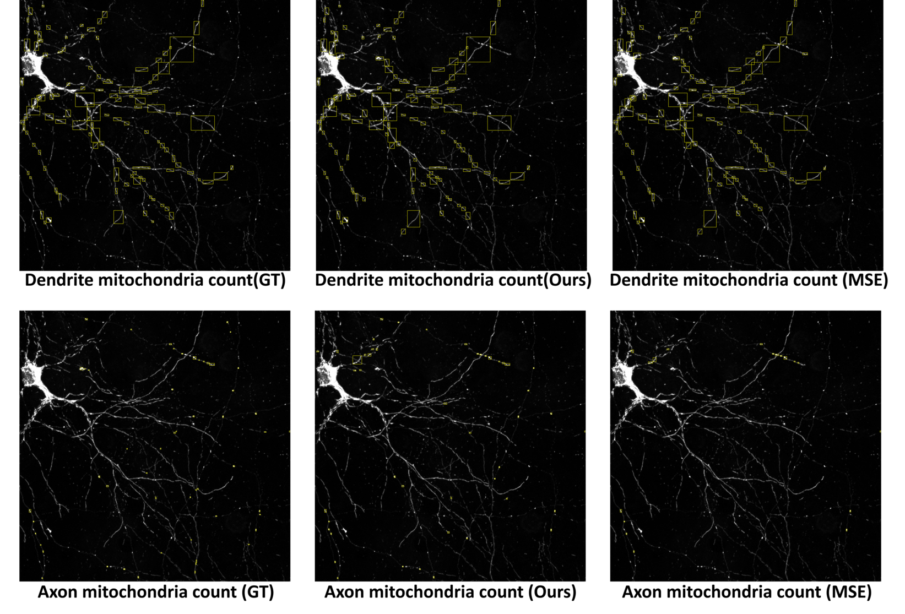

# ARAIProject
The advance of learning-based segmentation method has achieved remarkable success with sufficient training target and label pairs in medical image analysis. However, supervised learning based approaches have a concern that label quality determines its performance. We propose a noise-tolerant adaptive loss to mitigate high labeling cost without performance degradation in cell structure segmentation. Furthermore, we propose a reconstruction loss based on the prior knowledge of cell structure segmentation to avoid false prediction. We demonstrate that proposed loss outperforms state-of-the-art noise tolerant loss such as reverse cross entropy (RCE), normalized cross entropy (NCE) and NC-Dice as well as mean absolute error (MAE). 

#####Result
-----------

The ground truth (i.e full label) shows the result of cell counting for each structure.In the case of mitochondria in the dendrite part, the size of the mitochondria is generally large and has a lot of long linear characteristics~\cite{park2020super}, so in a test set with a total of 3 full labels, the number of cells of the proposed method is similar to that of MSE. Axons are generally short and have small morphological features~\cite{park2020super}, so  most mitochondria counting is not obtained in MSE, due to many unlabeled parts.On the other hand, the label obtained many counting after utilizing the proposed loss.Since my loss has improved a lot to the recall value, indicating that axon counts the cell similarly to GT.Through this result, I expected that when compared to the traditional method for obtaining mitochondria, the Network that applied the proposed network can be shortened in time to get mitochondria features and more detail about characteristics in a small area.

 
