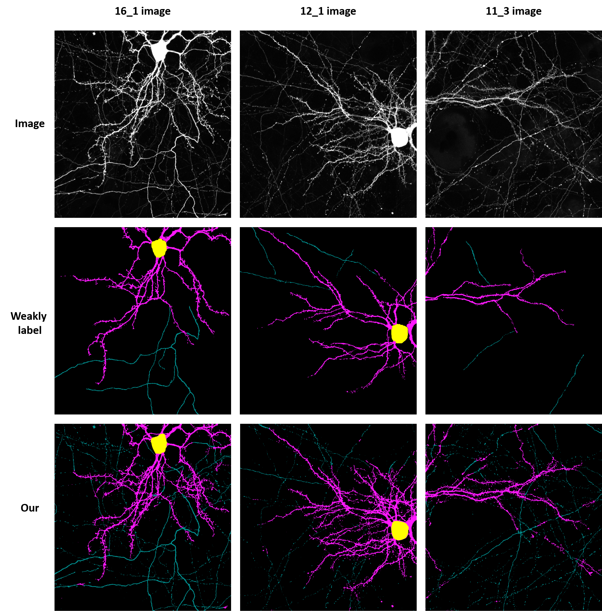

# ARAIProject
The advance of learning-based segmentation method has achieved remarkable success with sufficient training target and label pairs in medical image analysis. However, supervised learning based approaches have a concern that label quality determines its performance. We propose a noise-tolerant adaptive loss to mitigate high labeling cost without performance degradation in cell structure segmentation. Furthermore, we propose a reconstruction loss based on the prior knowledge of cell structure segmentation to avoid false prediction. We demonstrate that proposed loss outperforms state-of-the-art noise tolerant loss such as reverse cross entropy (RCE), normalized cross entropy (NCE) and NC-Dice as well as mean absolute error (MAE). 

#####Result
-----------

 
